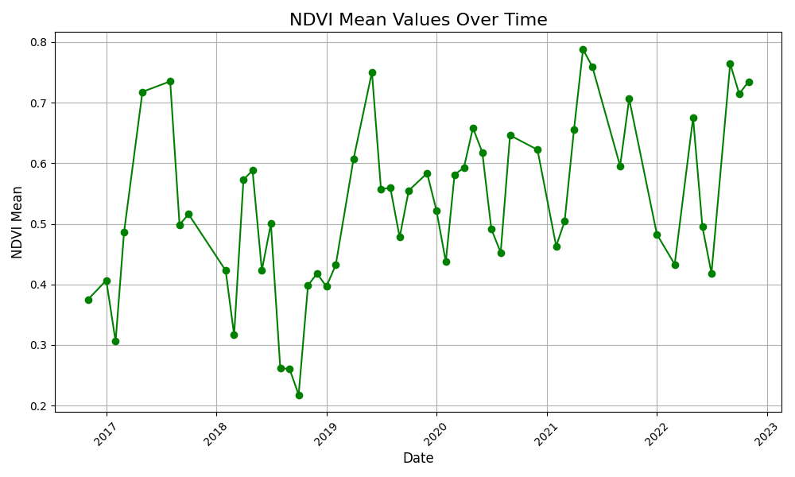

# NDVI Calculation using SentinelHub

This project calculates the Normalized Difference Vegetation Index (NDVI) for a specified area using SentinelHub's Statistical API. The images used are atmospherically corrected, and clouds are filtered out based on the Scene Classification Map (SCL) and Cloud Mask (CLM).


## Installation

1. Install the required packages:
    ```sh
    pip install pandas python-dotenv sentinelhub
    ```

2. Create a `.env` file in the root directory and add your SentinelHub credentials:
    ```env
    SH_INSTANCE_ID=your_instance_id
    SH_CLIENT_ID=your_client_id
    SH_CLIENT_SECRET=your_client_secret
    ```


## Explanation of the Evalscript

The `evalscript` is a JavaScript code that runs on the SentinelHub server to process satellite images. Here is a breakdown of the script:

1. **Cloud Filtering Function**:
    ```javascript
    function cloud_free(sample) {
      var scl = sample.SCL;
      var clm = sample.CLM;

      if (clm === 1 || clm === 255) {
        return false;
      } else if (scl === 1 || scl === 3 || scl === 8 || scl === 9 || scl === 10 || scl === 11) {
        return false;
      } else {
        return true;
      }
    }
    ```
    This function filters out clouds based on the Scene Classification Map (SCL) and Cloud Mask (CLM).

2. **Setup Function**:
    ```javascript
    function setup() {
      return {
        input: [{
          bands: [
            "B04",
            "B08",
            "SCL",
            "CLM",
            "dataMask"
          ]
        }],
        mosaicking: "ORBIT",
        output: [
          {
            id: "data",
            bands: ["daily_max_ndvi"]
          },
          {
            id: "dataMask",
            bands: 1
          }
        ]
      };
    }
    ```
    This function defines the input bands and the output format. It specifies that the script will use bands B04 (red), B08 (near-infrared), SCL, CLM, and dataMask.

3. **Evaluate Pixel Function**:
    ```javascript
    function evaluatePixel(samples, scenes) {
      var max = 0;
      var hasData = 0;

      for (var i = 0; i < samples.length; i++) {
        var sample = samples[i];

        if (cloud_free(sample) && sample.dataMask == 1 && sample.B04 + sample.B08 != 0) {
          hasData = 1;
          var ndvi = (sample.B08 - sample.B04) / (sample.B08 + sample.B04);
          max = ndvi > max ? ndvi : max;
        }
      }

      return {
        data: [max],
        dataMask: [hasData]
      };
    }
    ```
    This function calculates the NDVI for each pixel, filters out cloudy pixels, and returns the maximum NDVI value for each day.


## Usage
1. Run the script:
    ```sh
    python ndvi.py
    ```

2. Plot the results:
    ```sh
    python plot.py
    ```


## Results



